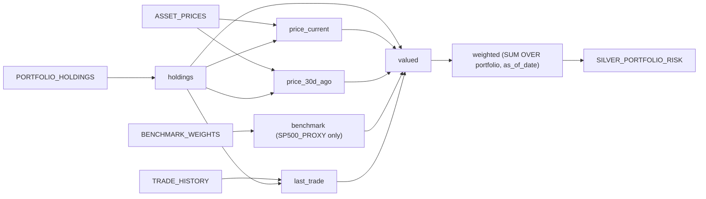

## Context

Session: account `SNOWHOUSE` (`AWS_US_WEST_2`), user `SGOKARAM`, role `SALES_ENGINEER`, context `TEMP.SGOKARAM_COCO_DEMO`, warehouse `SE_WH`.

What the schema probe found, and why it shapes the SQL:

| Table | Rows | Grain finding |
|---|---|---|
| `PORTFOLIO_HOLDINGS` | 120 | 60 (portfolio, asset) pairs x **2 snapshots** (2026-08-29, 2026-09-15); 3 portfolios |
| `ASSET_PRICES` | 11,040 | 20 assets x 552 daily dates, 2024-08-05 .. 2026-09-15; one row per (asset, date) |
| `BENCHMARK_WEIGHTS` | 120 | **3 benchmarks** x 20 tickers x 2 as_of_dates. S&P 500 is `benchmark_id = 'SP500_PROXY'` ("S&P 500 Proxy") |
| `TRADE_HISTORY` | 100 | BUY/SELL, 2026-06-19 .. 2026-09-15, keyed by (portfolio_id, ticker) |

Three findings that changed the design:

1. **Holdings is a 2-snapshot table, not a current-state table.** Per your answer, the DT keeps both snapshots at `(portfolio_id, asset_id, as_of_date)` grain = 120 rows, and every metric is resolved *as of* the snapshot date rather than globally. So `current_price` is the latest close on or before `as_of_date`, benchmark weight joins on `as_of_date`, and `recent_trade_type` only considers trades at or before `as_of_date`. No lookahead leakage into the older snapshot.
2. **`BENCHMARK_WEIGHTS` must be filtered.** Without `benchmark_id = 'SP500_PROXY'` the join fans out 3x and silently triples every portfolio's row count. This is the one real correctness trap in the requirements.
3. **Change tracking is OFF on all four base tables.** Snowflake will auto-enable it during DT creation since you own the tables, but I'd rather set it explicitly first so creation doesn't silently mutate the sources.

I validated the full SELECT against live data before writing this plan: 12 sample rows returned, `weight_pct` sums per (portfolio, snapshot), `position_label` distributes across all three values, and outer joins keep holdings with no trade history (`UNH`, `MA`, `GOOGL` have NULL `recent_trade_type`) rather than dropping them.

One data-quality note, not a bug in the DT: the synthetic price series is very noisy, so `return_30d_pct` produces values like `+761%` for MA and `-61%` for NVDA. The calculation is correct; the generated prices are not realistic. Worth knowing before you put this on a screen.

### Dataflow



---

## Implementation steps

### Step 1 - Enable change tracking

```sql
USE DATABASE TEMP;
USE SCHEMA SGOKARAM_COCO_DEMO;
USE WAREHOUSE SE_WH;

ALTER TABLE TEMP.SGOKARAM_COCO_DEMO.PORTFOLIO_HOLDINGS SET CHANGE_TRACKING = TRUE;
ALTER TABLE TEMP.SGOKARAM_COCO_DEMO.ASSET_PRICES       SET CHANGE_TRACKING = TRUE;
ALTER TABLE TEMP.SGOKARAM_COCO_DEMO.BENCHMARK_WEIGHTS  SET CHANGE_TRACKING = TRUE;
ALTER TABLE TEMP.SGOKARAM_COCO_DEMO.TRADE_HISTORY      SET CHANGE_TRACKING = TRUE;
```

Never turn this back off while the DT exists - refreshes will start failing.

### Step 2 - Create the dynamic table

```sql
USE DATABASE TEMP;
USE SCHEMA SGOKARAM_COCO_DEMO;
USE WAREHOUSE SE_WH;

CREATE OR ALTER DYNAMIC TABLE TEMP.SGOKARAM_COCO_DEMO.SILVER_PORTFOLIO_RISK
  TARGET_LAG   = '1 hour'
  WAREHOUSE    = SE_WH
  REFRESH_MODE = AUTO
  INITIALIZE   = ON_CREATE
  COMMENT      = 'Silver: portfolio holdings enriched with as-of pricing, S&P 500 active weights, 30d return and latest trade direction. Grain: portfolio_id x asset_id x as_of_date.'
AS
WITH holdings AS (
    -- Grain of the output: one row per portfolio / asset / snapshot date.
    SELECT
        portfolio_id,
        asset_id,
        ticker,
        asset_class,
        sector,
        quantity,
        as_of_date
    FROM TEMP.SGOKARAM_COCO_DEMO.PORTFOLIO_HOLDINGS
),

price_current AS (
    -- Latest close on or before the snapshot date (markets are closed some days,
    -- so this is a point-in-time lookup, not an equality join on as_of_date).
    SELECT
        h.portfolio_id,
        h.asset_id,
        h.as_of_date,
        p.close_price AS current_price,
        p.price_date  AS current_price_date
    FROM holdings h
    JOIN TEMP.SGOKARAM_COCO_DEMO.ASSET_PRICES p
      ON p.asset_id   = h.asset_id
     AND p.price_date <= h.as_of_date
    QUALIFY ROW_NUMBER() OVER (
        PARTITION BY h.portfolio_id, h.asset_id, h.as_of_date
        ORDER BY p.price_date DESC
    ) = 1
),

price_30d_ago AS (
    -- Same point-in-time rule, anchored 30 calendar days earlier.
    SELECT
        h.portfolio_id,
        h.asset_id,
        h.as_of_date,
        p.close_price AS price_30d_ago,
        p.price_date  AS price_30d_ago_date
    FROM holdings h
    JOIN TEMP.SGOKARAM_COCO_DEMO.ASSET_PRICES p
      ON p.asset_id   = h.asset_id
     AND p.price_date <= DATEADD('day', -30, h.as_of_date)
    QUALIFY ROW_NUMBER() OVER (
        PARTITION BY h.portfolio_id, h.asset_id, h.as_of_date
        ORDER BY p.price_date DESC
    ) = 1
),

benchmark AS (
    -- MUST filter to one benchmark: the table also holds NASDAQ-100 and Dow
    -- proxies, which would fan every holding out 3x.
    SELECT
        ticker,
        as_of_date,
        weight_pct AS benchmark_weight_pct
    FROM TEMP.SGOKARAM_COCO_DEMO.BENCHMARK_WEIGHTS
    WHERE benchmark_id = 'SP500_PROXY'
),

last_trade AS (
    -- Most recent trade for the position at or before the snapshot date.
    -- trade_id breaks same-day ties deterministically.
    SELECT
        h.portfolio_id,
        h.ticker,
        h.as_of_date,
        t.trade_type AS recent_trade_type,
        t.trade_date AS recent_trade_date
    FROM holdings h
    JOIN TEMP.SGOKARAM_COCO_DEMO.TRADE_HISTORY t
      ON t.portfolio_id = h.portfolio_id
     AND t.ticker       = h.ticker
     AND t.trade_date  <= h.as_of_date
    QUALIFY ROW_NUMBER() OVER (
        PARTITION BY h.portfolio_id, h.ticker, h.as_of_date
        ORDER BY t.trade_date DESC, t.trade_id DESC
    ) = 1
),

valued AS (
    -- LEFT JOINs throughout: a holding with no price, no benchmark membership
    -- or no trade history must survive with NULLs rather than vanish.
    SELECT
        h.portfolio_id,
        h.asset_id,
        h.ticker,
        h.asset_class,
        h.sector,
        h.as_of_date,
        h.quantity,
        pc.current_price,
        pc.current_price_date,
        ROUND(h.quantity * pc.current_price, 2) AS market_value_usd,
        p30.price_30d_ago,
        b.benchmark_weight_pct,
        lt.recent_trade_type,
        lt.recent_trade_date
    FROM holdings h
    LEFT JOIN price_current pc
           ON pc.portfolio_id = h.portfolio_id
          AND pc.asset_id     = h.asset_id
          AND pc.as_of_date   = h.as_of_date
    LEFT JOIN price_30d_ago p30
           ON p30.portfolio_id = h.portfolio_id
          AND p30.asset_id     = h.asset_id
          AND p30.as_of_date   = h.as_of_date
    LEFT JOIN benchmark b
           ON b.ticker     = h.ticker
          AND b.as_of_date = h.as_of_date
    LEFT JOIN last_trade lt
           ON lt.portfolio_id = h.portfolio_id
          AND lt.ticker       = h.ticker
          AND lt.as_of_date   = h.as_of_date
),

weighted AS (
    -- Portfolio weight is share of that portfolio's value in that snapshot,
    -- so the window partitions on both keys. NULLIF guards an empty portfolio.
    SELECT
        v.*,
        ROUND(
            100 * v.market_value_usd
            / NULLIF(SUM(v.market_value_usd) OVER (
                  PARTITION BY v.portfolio_id, v.as_of_date
              ), 0)
        , 4) AS weight_pct
    FROM valued v
)

SELECT
    portfolio_id,
    asset_id,
    ticker,
    asset_class,
    sector,
    as_of_date,
    quantity,
    current_price,
    current_price_date,
    market_value_usd,
    weight_pct,
    benchmark_weight_pct,
    -- A holding absent from the benchmark is a 0% benchmark weight, not unknown,
    -- so COALESCE is the correct treatment for active weight.
    ROUND(weight_pct - COALESCE(benchmark_weight_pct, 0), 4) AS active_weight_pct,
    CASE
        WHEN weight_pct - COALESCE(benchmark_weight_pct, 0) >  2 THEN 'OVERWEIGHT'
        WHEN weight_pct - COALESCE(benchmark_weight_pct, 0) < -2 THEN 'UNDERWEIGHT'
        ELSE 'NEUTRAL'
    END AS position_label,
    ROUND(100 * (current_price - price_30d_ago) / NULLIF(price_30d_ago, 0), 4) AS return_30d_pct,
    recent_trade_type,
    recent_trade_date
FROM weighted;
```

Notes on the DDL choices:

- **`CREATE OR ALTER`, per your requirement.** Re-running it with an unchanged definition is a no-op: refresh history, recommendations and grants survive. `CREATE OR REPLACE` would reset all of that and cascade reinitialization to any downstream incremental DT.
- **No explicit column list.** With `CREATE OR ALTER` an explicit column list becomes a contract you must keep in lockstep with the SELECT, and column *type* changes and reorders are not supported by `CREATE OR ALTER` at all - they'd force you into `CREATE OR REPLACE`, exactly what you asked to avoid. Letting the DT infer its schema keeps rehearsal edits cheap.
- **Rehearsal caveat:** if you edit the SELECT between rehearsals, that *is* a definition change and the table reinitializes (full recompute) on its next refresh. Refresh history and recommendations are preserved, and downstream DTs are not touched. Only a completely unchanged statement is a true no-op.
- **`INITIALIZE = ON_CREATE`** populates immediately - no empty-table window mid-demo.
- `26 columns`, 120 rows, well under a second to compute.

### Step 3 - Why TARGET_LAG = '1 hour'

Target lag is a *staleness ceiling*, not a schedule. Snowflake refreshes only when a base table actually changed, so an hour of headroom on daily data costs nothing when nothing moves.

- **Upstream cadence sets the floor.** Prices land daily. Anything tighter than a day buys no fresher data - it just adds scheduler checks against unchanged sources.
- **Headroom is the point.** At `'1 hour'`, a late or re-run price load is picked up within the hour instead of waiting for tomorrow. A backfill or correction to `PORTFOLIO_HOLDINGS` also shows up the same morning.
- **Why not `'1 day'`.** It technically matches the data cadence, but a single failed refresh then puts you a full day stale with no room to recover before the next scheduled attempt. An hour gives ~24 recovery opportunities per day at effectively zero cost, since refreshes are skipped when nothing changed.
- **Why not `'5 minutes'`.** With `FULL` refresh you'd pay a full recompute every time anything upstream changes, for data that only moves once a day. Meaningless on 120 rows, actively wasteful at production scale.
- **Why not `DOWNSTREAM`.** This is a Silver leaf table you'll query directly. `DOWNSTREAM` only refreshes when a dependent DT demands it - with no dependents it would go effectively stale. Reserve `DOWNSTREAM` for intermediate DTs, and switch this one to it only if a Gold DT is later built on top.

`'1 hour'` also stays comfortably above the 1-minute minimum and above any upstream DT lag, so no lag-hierarchy violation.

### Step 4 - Expected refresh mode

You chose `AUTO`. It will resolve to **`FULL`**, and it's worth knowing why before someone asks:

- `QUALIFY ROW_NUMBER() OVER (...)` in three CTEs - ranking window functions are not incrementally maintainable.
- `SUM(...) OVER (PARTITION BY portfolio_id, as_of_date)` - a change to any one holding changes the denominator for every other row in that portfolio snapshot.
- Non-equality join predicates (`p.price_date <= h.as_of_date`) on the price lookups.

`refresh_mode_reason` from `SHOW DYNAMIC TABLES` will state this explicitly - useful as a demo beat. At 120 rows `FULL` is the right answer anyway. The migration path, if this ever grew to real volume, is to split the point-in-time price lookups into their own DTs so the leaf table reduces to equality joins.

---

## Verification

```sql
-- 1. Config + resolved mode. Read refresh_mode and refresh_mode_reason.
SHOW DYNAMIC TABLES LIKE 'SILVER_PORTFOLIO_RISK' IN SCHEMA TEMP.SGOKARAM_COCO_DEMO;

-- 2. Initial refresh outcome.
USE DATABASE TEMP;
SELECT name, state, state_message, refresh_action,
       refresh_start_time, refresh_end_time,
       DATEDIFF('second', refresh_start_time, refresh_end_time) AS duration_s
FROM TABLE(INFORMATION_SCHEMA.DYNAMIC_TABLE_REFRESH_HISTORY(
    NAME => 'TEMP.SGOKARAM_COCO_DEMO.SILVER_PORTFOLIO_RISK'
))
ORDER BY refresh_start_time DESC
LIMIT 5;

-- 3. Grain and fan-out check. Expect 120 / 120 / 2 / 3.
SELECT COUNT(*)                                                   AS rows_total,
       COUNT(DISTINCT portfolio_id || asset_id || as_of_date::STRING) AS distinct_grain,
       COUNT(DISTINCT as_of_date)                                 AS snapshots,
       COUNT(DISTINCT portfolio_id)                               AS portfolios
FROM TEMP.SGOKARAM_COCO_DEMO.SILVER_PORTFOLIO_RISK;

-- 4. Weights must sum to ~100 per portfolio per snapshot.
SELECT portfolio_id, as_of_date,
       ROUND(SUM(weight_pct), 2)        AS total_weight_pct,
       ROUND(SUM(active_weight_pct), 2) AS total_active_weight_pct
FROM TEMP.SGOKARAM_COCO_DEMO.SILVER_PORTFOLIO_RISK
GROUP BY 1, 2
ORDER BY 1, 2;

-- 5. Nothing silently dropped, and labels distribute.
SELECT position_label, COUNT(*) AS n,
       COUNT_IF(current_price IS NULL)     AS missing_price,
       COUNT_IF(return_30d_pct IS NULL)    AS missing_30d,
       COUNT_IF(recent_trade_type IS NULL) AS no_trade_history
FROM TEMP.SGOKARAM_COCO_DEMO.SILVER_PORTFOLIO_RISK
GROUP BY 1 ORDER BY 2 DESC;
```

Pass criteria: `state = 'SUCCESS'`; `rows_total = distinct_grain = 120`; `total_weight_pct` = 100.00 for all 6 portfolio-snapshot pairs; `missing_price = 0`. `no_trade_history > 0` is expected and correct - some positions have never traded.

---

## Operating runbook

### Daily check - is it healthy

```sql
SHOW DYNAMIC TABLES LIKE 'SILVER_PORTFOLIO_RISK' IN SCHEMA TEMP.SGOKARAM_COCO_DEMO;
```
Want: `scheduling_state` = `ACTIVE` (not `SUSPENDED`), `refresh_mode` = `FULL`, `target_lag` = `1 hour`.

```sql
USE DATABASE TEMP;
SELECT name, scheduling_state:state::STRING AS sched_state,
       target_lag_sec, mean_lag_sec, maximum_lag_sec,
       time_within_target_lag_ratio, latest_data_timestamp,
       last_completed_refresh_state, last_completed_refresh_state_message
FROM TABLE(INFORMATION_SCHEMA.DYNAMIC_TABLES(
    NAME => 'TEMP.SGOKARAM_COCO_DEMO.SILVER_PORTFOLIO_RISK'
));
```
`time_within_target_lag_ratio` is the SLA number. Below ~0.95 sustained means the lag is too tight for how long refreshes actually take.

### Errors only

```sql
USE DATABASE TEMP;
SELECT name, state, state_message, refresh_start_time
FROM TABLE(INFORMATION_SCHEMA.DYNAMIC_TABLE_REFRESH_HISTORY(
    NAME       => 'TEMP.SGOKARAM_COCO_DEMO.SILVER_PORTFOLIO_RISK',
    ERROR_ONLY => TRUE
))
ORDER BY refresh_start_time DESC
LIMIT 10;
```

### Refresh duration trend

```sql
USE DATABASE TEMP;
SELECT DATE_TRUNC('hour', refresh_start_time) AS hr,
       COUNT(*) AS refreshes,
       COUNT_IF(state = 'FAILED') AS failed,
       ROUND(AVG(DATEDIFF('second', refresh_start_time, refresh_end_time)), 1) AS avg_s,
       MAX(DATEDIFF('second', refresh_start_time, refresh_end_time))           AS max_s
FROM TABLE(INFORMATION_SCHEMA.DYNAMIC_TABLE_REFRESH_HISTORY(
    NAME => 'TEMP.SGOKARAM_COCO_DEMO.SILVER_PORTFOLIO_RISK'
))
WHERE refresh_start_time > DATEADD('day', -7, CURRENT_TIMESTAMP())
GROUP BY 1 ORDER BY 1 DESC;
```

If duration creeps toward the 1-hour lag, that's the signal to decompose the point-in-time price lookups into separate DTs.

### Recommendations from Snowflake

```sql
USE DATABASE TEMP;
SELECT rec.value:"code"::STRING AS code, rec.value:"info"::STRING AS info
FROM TABLE(INFORMATION_SCHEMA.DYNAMIC_TABLES(
         NAME => 'TEMP.SGOKARAM_COCO_DEMO.SILVER_PORTFOLIO_RISK')) dt,
     LATERAL FLATTEN(INPUT => dt.recommendations:recommendations) rec;
```
Empty right after creation - recommendations need refresh history to accumulate. Preserving that history is the main reason `CREATE OR ALTER` is the right command here.

### Failure patterns specific to this table

| Symptom | Likely cause | Fix |
|---|---|---|
| Refresh fails: change tracking error | Someone set `CHANGE_TRACKING = FALSE` on a base table, or a base table was replaced | Re-enable on all four, then `ALTER DYNAMIC TABLE ... REFRESH` |
| `scheduling_state` = `SUSPENDED` | Repeated failures auto-suspended it, or manual suspend | Fix root cause, then `ALTER DYNAMIC TABLE ... RESUME` |
| Row count jumps to ~360 | `benchmark_id` filter lost or a new benchmark added to `BENCHMARK_WEIGHTS` | Restore `WHERE benchmark_id = 'SP500_PROXY'` |
| `total_weight_pct` not 100 | `market_value_usd` NULL for some rows, i.e. a holding has no price at or before its `as_of_date` | Check `ASSET_PRICES` coverage for that `asset_id` |
| `return_30d_pct` NULL for a batch | Price history shorter than 30 days before `as_of_date` | Expected for newly listed assets; NULL is correct, don't coalesce to 0 |
| Whole table NULL-y after a source reload | Base table dropped and recreated - DT lost change tracking lineage | Re-enable change tracking and force a refresh |
| Downstream Gold DT errors 2742 | This DT is `FULL`; an incremental DT cannot depend on a `FULL` one | Make the downstream DT `FULL`, or decompose this one to be incrementalizable |
| `UPSTREAM_FAILED` on a dependent | A base table or upstream DT failed first | Diagnose the upstream failure; this DT recovers on its own once fixed |

Force a refresh on demand (e.g. right before a rehearsal run):
```sql
ALTER DYNAMIC TABLE TEMP.SGOKARAM_COCO_DEMO.SILVER_PORTFOLIO_RISK REFRESH;
```

---

## Critical objects

- `TEMP.SGOKARAM_COCO_DEMO.PORTFOLIO_HOLDINGS` - drives output grain; the 2-snapshot shape is the reason every metric is resolved as-of rather than globally
- `TEMP.SGOKARAM_COCO_DEMO.BENCHMARK_WEIGHTS` - holds 3 benchmarks; the `SP500_PROXY` filter is the single most important line in the query
- `TEMP.SGOKARAM_COCO_DEMO.ASSET_PRICES` - 552 daily dates per asset; supplies both `current_price` and the 30-day anchor via non-equality joins, which is what forces `FULL` refresh
- `TEMP.SGOKARAM_COCO_DEMO.TRADE_HISTORY` - LEFT JOIN only; positions that never traded must survive with NULL `recent_trade_type`
- [AGENTS.md](AGENTS.md) - mandates the `USE DATABASE / SCHEMA / WAREHOUSE` preamble on every SQL execution
